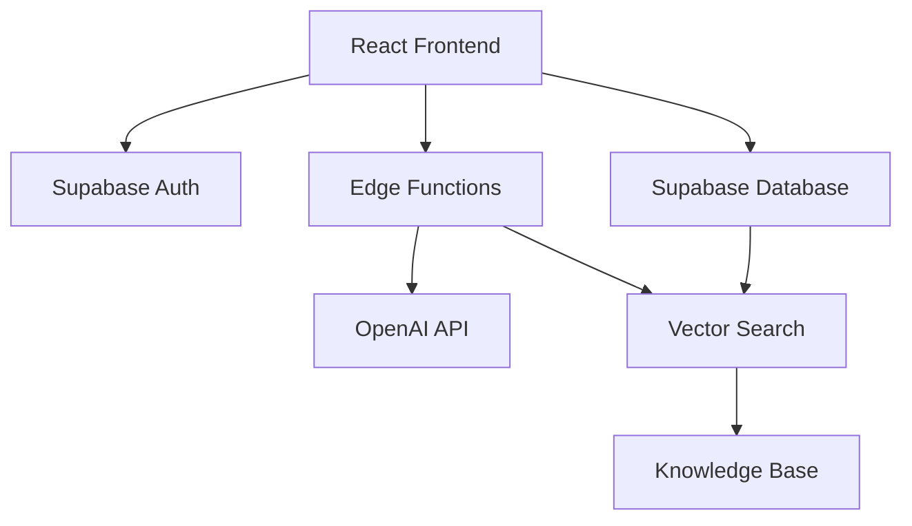

# Prompt Architect

> Enterprise-grade RAG-powered prompt engineering platform that generates production-ready AI prompts with quality scoring.


## ✨ Features

- 🎯 **RAG-Powered Generation**: Retrieves relevant context from your knowledge base
- 📊 **Quality Scoring**: 5-dimension quality metrics (Clarity, Completeness, Constraint Adherence, Determinism, Safety)
- 💬 **AI Interview Wizard**: Conversational AI helps you define requirements
- 📚 **Knowledge Base Management**: Upload PDFs, docs, or paste text
- 🔄 **Iteration Support**: Refine prompts with full history tracking
- 🔒 **Enterprise Security**: Row-level security, encrypted storage, auth built-in
- 🎨 **Modern UI**: Beautiful, responsive interface with dark mode

## 🚀 Quick Start

### Option 1: Use the Hosted Version (Easiest)

Visit the deployed app and sign up for free (if available).

### Option 2: Deploy Your Own (Recommended for Communities)

Follow the comprehensive [DEPLOYMENT_GUIDE.md](./DEPLOYMENT_GUIDE.md) for:
- Lovable Cloud deployment (5 minutes, zero DevOps)
- Self-hosted deployment with Supabase (full control)

## 📖 Documentation

- **[USAGE_GUIDE.md](./USAGE_GUIDE.md)** - How to use Prompt Architect
- **[DEPLOYMENT_GUIDE.md](./DEPLOYMENT_GUIDE.md)** - Step-by-step deployment instructions
- **[CONTRIBUTING.md](./CONTRIBUTING.md)** - Contribution guidelines
- **[COMPLIANCE.md](./COMPLIANCE.md)** - Legal & compliance guide for deployers

## 🏗️ Architecture



**Tech Stack:**
- **Frontend**: React 18, TypeScript, Tailwind CSS, shadcn/ui
- **Backend**: Supabase (PostgreSQL + pgvector + Edge Functions)
- **AI**: OpenAI GPT-4 (metaprompting), text-embedding-3-small (RAG)
- **Build**: Vite
- **Deployment**: Lovable Cloud, Vercel, Netlify, Cloudflare Pages

## 🔧 Local Development

### Prerequisites
- Node.js 18+
- npm or bun
- Supabase account (for backend)
- OpenAI API key

### Setup

1. **Clone the repository**:
   ```bash
   git clone https://github.com/YOUR_USERNAME/prompt-architect.git
   cd prompt-architect
   ```

2. **Install dependencies**:
   ```bash
   npm install
   ```

3. **Set up Supabase**:
   - Create a project at [supabase.com](https://supabase.com)
   - Run migrations: `supabase db push`
   - Configure secrets: `supabase functions secrets set OPENAI_API_KEY=your_key`

4. **Configure environment variables**:
   ```bash
   # Create .env file
   VITE_SUPABASE_URL=your_supabase_url
   VITE_SUPABASE_ANON_KEY=your_anon_key
   VITE_SUPABASE_PROJECT_ID=your_project_id
   ```

5. **Run development server**:
   ```bash
   npm run dev
   ```

6. **Deploy Edge Functions** (in separate terminal):
   ```bash
   supabase functions deploy prompt-architect
   supabase functions deploy generate-embedding
   ```

See [DEPLOYMENT_GUIDE.md](./DEPLOYMENT_GUIDE.md) for detailed instructions.

## 📚 How It Works

1. **Upload Knowledge Base**: Add your documentation, best practices, or examples
2. **Define Requirements**: Fill out the form (or use AI Interview)
   - Goal: What should the prompt accomplish?
   - Audience: Who will use the output?
   - Inputs: What data will be provided?
   - Output Format: How should results be structured?
   - Constraints: Any rules or limitations?
3. **Generate Prompt**: RAG retrieves relevant context, GPT-4 crafts the prompt
4. **Quality Check**: Automatic scoring on 5 dimensions
5. **Iterate**: Refine based on feedback and quality metrics

## 🎯 Use Cases

- **Product Teams**: Generate prompts for customer support, content generation
- **Developers**: Create prompts for code review, documentation, testing
- **Marketers**: Build prompts for ad copy, email campaigns, social media
- **Educators**: Design prompts for student assessments, lesson plans
- **Researchers**: Craft prompts for data analysis, literature review

## 🤝 Contributing

We welcome contributions! See [CONTRIBUTING.md](./CONTRIBUTING.md) for:
- Development workflow
- Code style guidelines
- Security requirements
- How to submit pull requests

## ⚖️ License

This project is licensed under the MIT License - see [LICENSE](./LICENSE) file for details.

## 🔒 Security & Compliance

- **Data Protection**: All user data is encrypted and isolated with RLS
- **Authentication**: Secure email/password via Supabase Auth
- **API Security**: Service role keys only in edge functions, never exposed
- **Compliance**: See [COMPLIANCE.md](./COMPLIANCE.md) for GDPR/CCPA guidance

**Found a security issue?** Email security@yourproject.com (or open a private vulnerability report on GitHub).

## 📊 Project Status

- ✅ Core RAG pipeline working
- ✅ Quality scoring implemented
- ✅ AI Interview wizard
- ✅ Knowledge base management
- ✅ Authentication & RLS
- 🚧 Leaked password protection (recommended)
- 🚧 Data export feature (GDPR)
- 🚧 Rate limiting (DDoS protection)

## 🙏 Acknowledgments

- Built with [Lovable](https://lovable.dev) - AI-powered web development
- Powered by [Supabase](https://supabase.com) - Open source Firebase alternative
- AI by [OpenAI](https://openai.com) - GPT-4 and embeddings
- UI components by [shadcn/ui](https://ui.shadcn.com)

## 📞 Support

- **Documentation**: See guides in this repo
- **Community**: GitHub Discussions (coming soon)
- **Issues**: GitHub Issues for bug reports
- **Contact**: your-email@example.com

---

**Built with ❤️ by the open source community**

## How can I edit this code?

There are several ways of editing your application.

**Use Lovable**

Simply visit the [Lovable Project](https://lovable.dev/projects/2f698369-8961-49dc-84b9-6780547acaa3) and start prompting.

Changes made via Lovable will be committed automatically to this repo.

**Use your preferred IDE**

If you want to work locally using your own IDE, you can clone this repo and push changes. Pushed changes will also be reflected in Lovable.

The only requirement is having Node.js & npm installed - [install with nvm](https://github.com/nvm-sh/nvm#installing-and-updating)

Follow these steps:

```sh
# Step 1: Clone the repository using the project's Git URL.
git clone <YOUR_GIT_URL>

# Step 2: Navigate to the project directory.
cd <YOUR_PROJECT_NAME>

# Step 3: Install the necessary dependencies.
npm i

# Step 4: Start the development server with auto-reloading and an instant preview.
npm run dev
```

**Edit a file directly in GitHub**

- Navigate to the desired file(s).
- Click the "Edit" button (pencil icon) at the top right of the file view.
- Make your changes and commit the changes.

**Use GitHub Codespaces**

- Navigate to the main page of your repository.
- Click on the "Code" button (green button) near the top right.
- Select the "Codespaces" tab.
- Click on "New codespace" to launch a new Codespace environment.
- Edit files directly within the Codespace and commit and push your changes once you're done.

## What technologies are used for this project?

This project is built with:

- Vite
- TypeScript
- React
- shadcn-ui
- Tailwind CSS

## How can I deploy this project?

Simply open [Lovable](https://lovable.dev/projects/2f698369-8961-49dc-84b9-6780547acaa3) and click on Share -> Publish.

## Can I connect a custom domain to my Lovable project?

Yes, you can!

To connect a domain, navigate to Project > Settings > Domains and click Connect Domain.

Read more here: [Setting up a custom domain](https://docs.lovable.dev/features/custom-domain#custom-domain)
